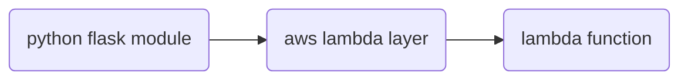

#serverless  flask webapplication with [aws lambda]



##create module & layer

update.sh  
```bash
export layername="dorian-flask"
export layerARN=arn:aws:lambda:ap-northeast-2:779626203419:layer:dorian-flask
export region=ap-northeast-2
export function=flask-test
aws --profile stg  --region $region lambda publish-layer-version --layer-name ${layername} --zip-file fileb://./python.zip


export function=flask-test
export layerARN=arn:aws:lambda:ap-northeast-2:779626203419:layer:dorian-flask:9
aws lambda update-function-configuration --function-name $function --layers $layerARN
```

install.sh
```bash
mkdir -r python
cd python
echo "flask
aws_lambda_powertools" > requirements.txt  
pip install -r requirements.txt  -t .
cd ..
zip -r python.zip python
./update.sh
```


